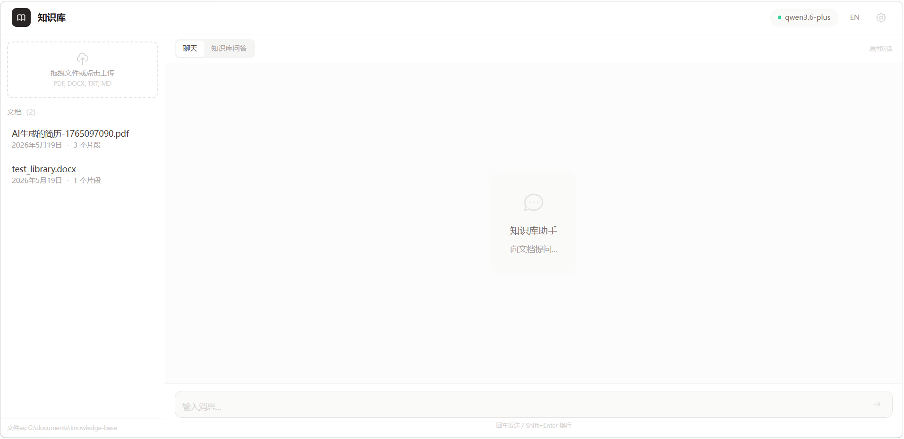

# Library — 个人知识库

基于 RAG 的本地知识库应用，支持文档上传、向量检索和 AI 问答。



## 功能

- **文档管理**：上传 PDF / DOCX，自动分块 + embedding 入库
- **AI 聊天**：流式对话，支持多模型（千问、DeepSeek、OpenAI 等）
- **RAG 问答**：选择文档提问，回答附带来源引用
- **中英文切换**：界面支持中文 / English 一键切换
- **可配置**：API Key、模型名、API 地址均可在设置面板自定义

## 技术栈

| 层 | 技术 |
|-----|------|
| 前端 | Vue 3 + Vite + TypeScript + Tailwind CSS |
| 后端 | Python FastAPI |
| 向量存储 | numpy + JSON |
| AI | 用户可配置 (DashScope / DeepSeek / OpenAI 兼容) |

## 快速开始

### 1. 克隆项目

```bash
git clone https://github.com/Yuan-hai/knowledge-base.git
cd knowledge-base
```

### 2. 配置后端

```bash
cd backend

# 创建虚拟环境
python -m venv venv

# Windows 激活
venv\Scripts\activate
# macOS/Linux 激活
source venv/bin/activate

# 安装依赖
pip install -r requirements.txt
```

### 3. 配置环境变量（可选）

复制 `.env.example` 或直接创建 `.env`：

```env
DASHSCOPE_API_KEY=your-api-key-here
```

> 也可以不配 `.env`，直接在应用设置面板里填 API Key，会保存到 `backend/data/settings.json`。

### 4. 设置文档上传路径

首次启动后，打开前端设置面板（右上角齿轮图标），将 **上传文件夹** 改为你存放文档的目录，例如：

```
Windows:  D:/Documents/knowledge-base
macOS:    /Users/xxx/Documents/knowledge-base
Linux:    /home/xxx/Documents/knowledge-base
```

### 5. 启动后端

```bash
cd backend
uvicorn main:app --reload --host 0.0.0.0 --port 8000
```

后端运行在 `http://localhost:8000`，首次启动会自动扫描上传文件夹并索引文档。

### 6. 启动前端

```bash
cd frontend
npm install
npm run dev
```

前端运行在 `http://localhost:5173`。

## 配置 AI 模型

打开前端 → 设置面板（右上角 ⚙），可配置：

| 配置项 | 说明 |
|--------|------|
| AI 模型 | 输入或选择模型名，如 `qwen-plus`、`deepseek-chat` |
| API Key | 你的 API 密钥 |
| API 基础地址 | Chat API 端点 |
| Embedding 地址 | Embedding API 端点 |
| Embedding 模型 | Embedding 模型名 |

设置面板提供常用地址推荐（阿里百炼 / DeepSeek / OpenAI），也可手动输入。

## 数据存储

| 文件 | 说明 | 是否纳入版本控制 |
|------|------|:---:|
| `backend/data/settings.json` | 用户配置（API Key、模型、路径） | ❌ |
| `backend/data/vectors.json` | 文档向量库 | ❌ |
| `backend/.env` | 环境变量 | ❌ |

以上文件会在首次运行时自动生成。删除后重启即可重建。

## 项目结构

```
library/
├── backend/
│   ├── main.py              # FastAPI 入口
│   ├── config.py            # 配置管理
│   ├── models/schemas.py    # 数据模型
│   ├── routers/             # API 路由
│   ├── services/            # 业务逻辑
│   ├── utils/               # 工具（文档解析、分块）
│   └── data/                # 运行时数据（不入库）
├── frontend/
│   └── src/
│       ├── pages/           # 页面
│       ├── components/      # 组件
│       ├── composables/     # 状态逻辑
│       ├── locales/         # 国际化 (中文/English)
│       └── types/           # TypeScript 类型
└── CLAUDE.md                # AI 开发指引
```

## License

MIT
